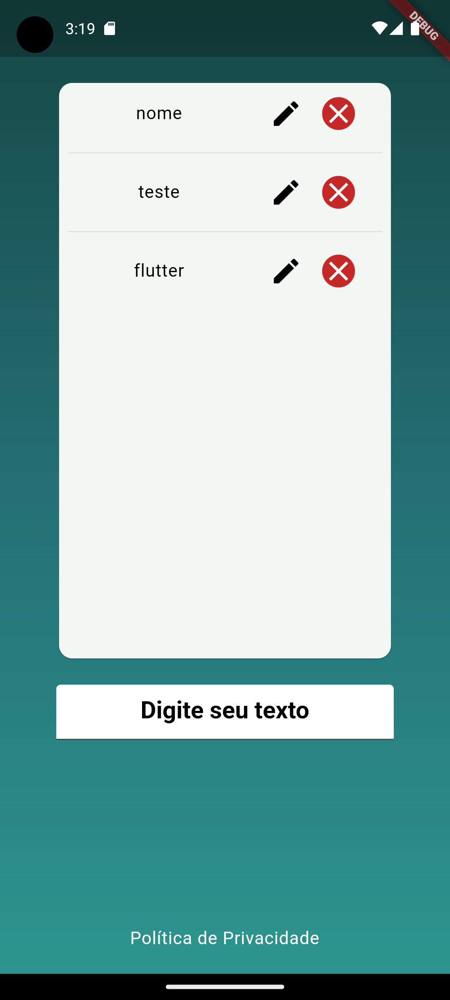

# Target Sistemas

Teste técnico para Desenvolvedor Flutter na Target Sistemas.

## Objetivos
O objetivo deste teste era construir duas páginas, se aproximando o máximo possível dos exemplos fornecidos pela empresa.

A primeira página seria uma página de login com validação. Uma vez que o usuário estivesse autenticado, avançaríamos para a próxima tela.

A segunda página se trata de uma página de anotações, permitindo com o que o usuário digite textos e salvando os mesmos em um banco de dados local, para que assim fosse feita a persistência dos dados.

## Resultado Final

## Observações
A arquitetura utilizada neste projeto é similar à Clean Architecture. Ela foi apresentada [nesse vídeo](https://youtu.be/qX6zmKY4KP0) feito pelo canal oficial do Android no Youtube. Também utilizei uma estrutura de pastas chamada de `feature-first`, como descrito neste [blog](https://codewithandrea.com/articles/flutter-project-structure/).

Na primeira página, como não havia requerimentos de bibliotecas, utilizei o pacote [bloc](https://bloclibrary.dev/#/) para interagir com o repositório e gerenciar o estado da aplicação. A validação dos dados e a criação dos formulários foram feitas manualmente, em Flutter puro, mas também seria possível utilizar pacotes como o [Formz](https://pub.dev/packages/formz), [flutter_form_builder](https://pub.dev/packages/flutter_form_builder) ou o próprio [mobx](https://pub.dev/packages/mobx) (como mostrado em sua [documentação oficial](https://mobx.netlify.app/examples/form)) para ajudar neste processo.

Na segunda página, os requerimentos eram de utilizar [mobx](https://pub.dev/packages/mobx) para o gerenciamento de estado e [shared_preferences](https://pub.dev/packages/shared_preferences) para persistência de dados. Como não havia utilizado `Mobx` antes, não soube extrair a lógica para um repositório ou serviço, mas acredito que a classe `NoteList` possa ser considerada como tal.

